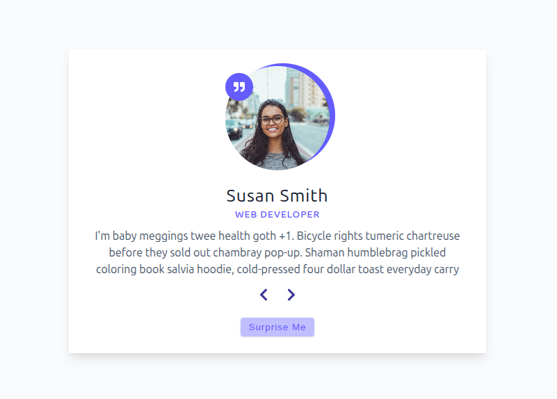

# Reviews Project ⭐


A React practice project focused on creating an interactive review carousel. Displays customer testimonials with navigation controls for a seamless user experience.



## ✨ Features

- **Review Carousel** - Navigate through reviews with next/previous buttons
- **Random Selection** - Discover random reviews with the "Surprise Me" feature
- **Responsive Design** - Optimized for all device sizes
- **Modern Icons** - Enhanced UI with React Icons library

## 💡 Key Learnings / Implemented Challenges

This project was created to complete specific challenges focused on foundational React concepts:

- **useState Hook** - Managing component state for current review index
- **Event Handling** - Implementing click events for navigation controls
- **Array Manipulation** - Using modulo operator for circular navigation
- **Component Structure** - Building a clean, reusable review component
- **Data Management** - Importing and utilizing static data efficiently
- **Conditional Logic** - Implementing smart review cycling
- **Course Data Integration** - Utilizing provided sample data with placeholder text
- **Random Content Handling** - Working with pre-generated Lorem Ipsum content for layout purposes

## 🧰 Built With

- Vite + React
- JavaScript (ES6+)
- HTML5 & CSS3
- React Icons

## ▶️ Live Demo

**View Live on Netlify:**
[Click here](https://reviews-project-gpdev.netlify.app/)

## 🎨 Design

Figma design provided by the course instructor:[ Preview here](https://www.figma.com/file/e8L2QiR4GVTa5cGuRpXtk3/Reviews?node-id=0%3A1&t=gcCYcePiKxnkJ9kH-1)

## 📦 Getting Started

### Prerequisites

- **Node.js ≥ 18**
- **npm or yarn**

### Installation

1. Clone the repository

```bash
git clone https://github.com/pro804/Reviews.git
```

2. Navigate to the project directory

```bash
cd Reviews
```

3. Install dependencies

```bash
npm install
```

4. Start the development server

```bash
npm run dev
```

5. Open http://localhost:5173 to view it in the browser.

## 🔧 Scripts

- `npm run dev` — Runs the development server (Vite)
- `npm run build` — Builds the app for production
- `npm run preview` — Previews the production build locally

## 📄 License

This project is created for educational purposes as part of a React learning journey.
